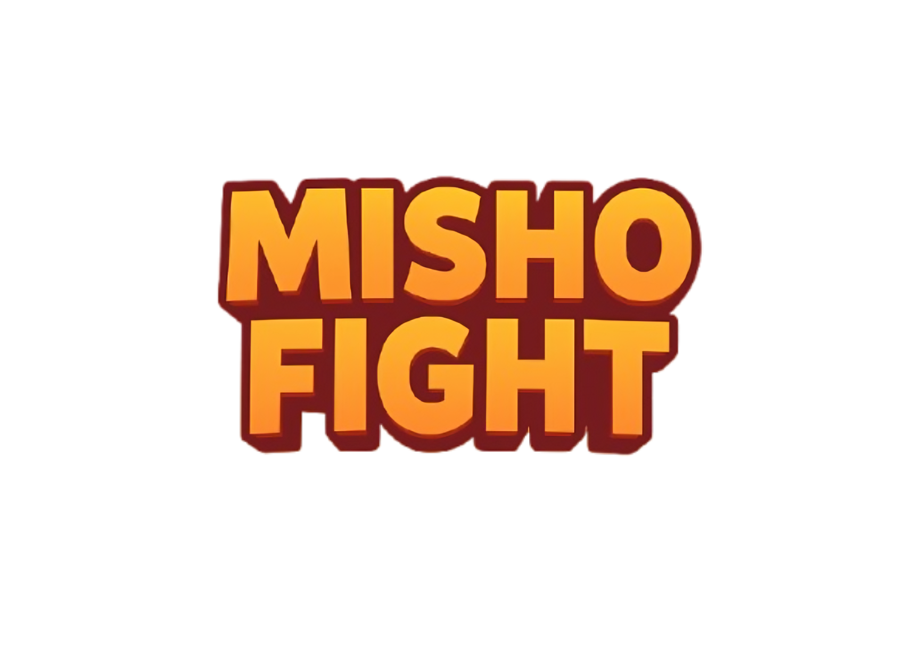

<h1 align="center" style="color: orange;">Funky Blades & Gobelin Escapades</h1>

## 🙏 Special Credits

### 🎨 Cel Shader

- **Rafael Bordoni (eldskald)**  
  Creator and owner of the Godot 4 cel shader used in this project.  
  This shader is licensed under the **MIT License** and is used in accordance with that license.  
  I am **not the owner** of this shader.
  - GitHub: https://github.com/eldskald
  - Shader Repository: https://github.com/eldskald/godot4-cel-shader
  - Learning Resource: I learned how to integrate and use the shader through Rafael Bordoni’s YouTube videos.

- **ShadyShade (The-Shady-Shade)**  
  Co-creator and contributor to the cel shader alongside Rafael Bordoni.
  - GitHub: https://github.com/The-Shady-Shade

---

### 🎨 Speedlines Shader and Shader tutorials in general

- **axilirate**  
  Speedlines shader.
  - Godot Shaders: https://godotshaders.com/author/axilirate/

- **Four Games**  
  Shader tutorials.
  - YouTube: https://www.youtube.com/@FourGamesDev

---

### 🎥 Assets & Tutorials

- **Rikikiz**  
  Assets and video tutorials that helped during development.
  - YouTube: https://www.youtube.com/@Rikikiz

- **Le Lu**  
  Particle assets and particle system tutorials used in this project.
  - YouTube: https://www.youtube.com/@Le_x_Lu

---

### 💾 Godot Add-onn's

- **Proton-Scatter**  
  For easier environment design.
  - Godot Asset Library: https://godotengine.org/asset-library/asset/1866
